## 概要

本リポジトリは、Go Gin（API モード） を用いて開発した、 Twitter クローンアプリのバックエンド API サーバーです。

フロントエンド（Next.js）と分離した API 専用構成で設計・実装しており、 認証・投稿など、SNS に必要な主要機能を網羅しています。

## URL
https://twitter-nextjs-frontend.vercel.app/

## 使用技術

### バックエンド
- Go 1.25.5
- Gin 1.12.0
- sqlc 1.24.0（SQLから型安全なGoコードを生成）

### データベース・キャッシュ
- PostgreSQL 14
- Redis

### インフラ・クラウド
- Docker
- AWS（ECS、RDS for PostgreSQL、ElastiCache for Redis、S3、ALB、SES、Route 53、ACM）

### その他
- Air（Goアプリのホットリロード）
- Gmail SMTP（メール送信）

## 機能一覧

- サインアップ・ログイン
- ユーザーアクティベーション(サインアップ時にGmailメール送信)
- ツイート
- ツイート詳細
- ツイート一覧(※ページネーション機能付き)
- ユーザー詳細
- いいね
- リツイート
- ブックマーク
- ブックマーク一覧(※ページネーション機能付き)
- フォロー
- フォロー一覧(※ページネーション機能付き)
- フォロワー一覧(※ページネーション機能付き)
- メッセージ機能(DM)
- 退会機能

## 工夫した点

- フロントエンド（Next.js）と完全分離した API 専用構成で設計
- RESTに沿ったエンドポイント設計
- 型安全性を意識した設計（request/response定義 + sqlc）
- N+1問題を考慮したクエリ最適化（JOIN / サブクエリの使い分け） Qiita記事: https://qiita.com/Rikuto-Iwashita/items/45107de8560c3238cf0e
- バリデーション・認証・セッション管理の実装（Redis使用）
- パスワードのハッシュ化によるセキュリティ強化

## 技術選定理由

- フレームワークへの依存が比較的少ない点に魅力を感じたため  
  → 自分でロジックを組みながら、処理の流れを理解しやすいと感じた

- 文法がシンプルで、実装途中に迷いにくいと感じたため  
  → 個人開発でも開発スピードを維持しやすい

- Javaの学習経験があったため、同じ静的型付け言語であるGoを採用  
  → 既存の知識を活かし、スムーズに開発できると考えた

## ER図

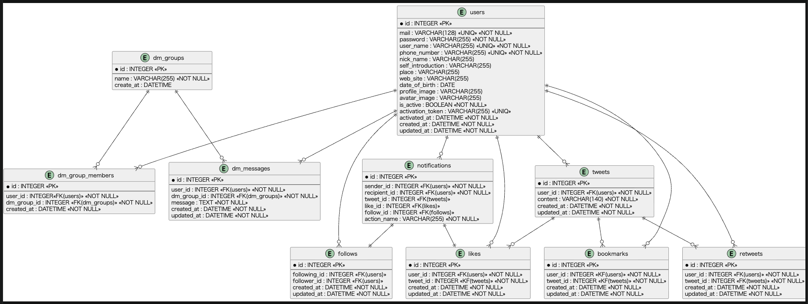

## AWS設計図

### AWS構築の記事
https://qiita.com/Rikuto-Iwashita/items/8dd956722c61e5cab97e

 

## 画面

#### サインアップ

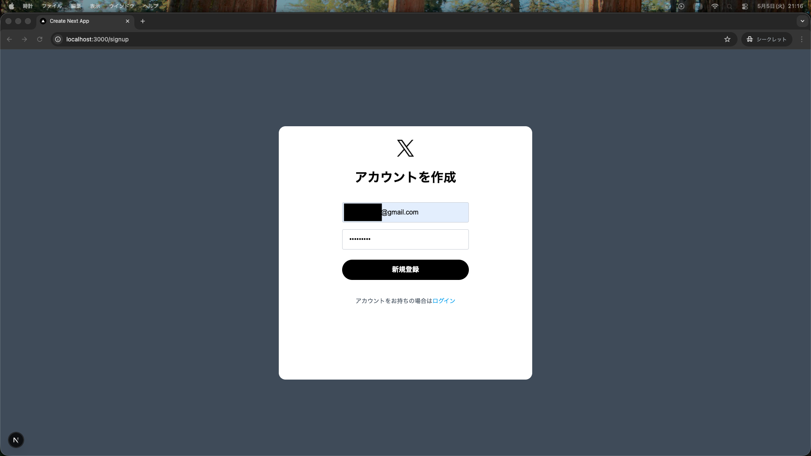

#### メール受信(Gmail)

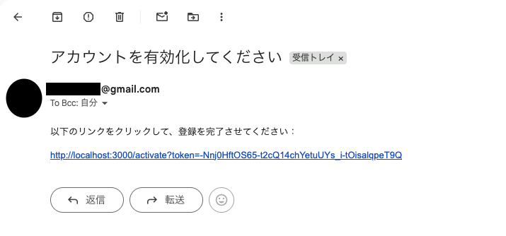

#### ログイン

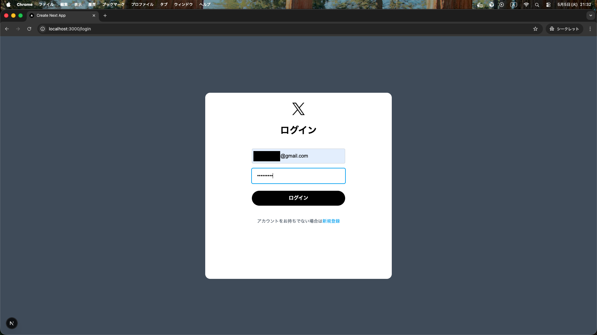

#### ツイート投稿

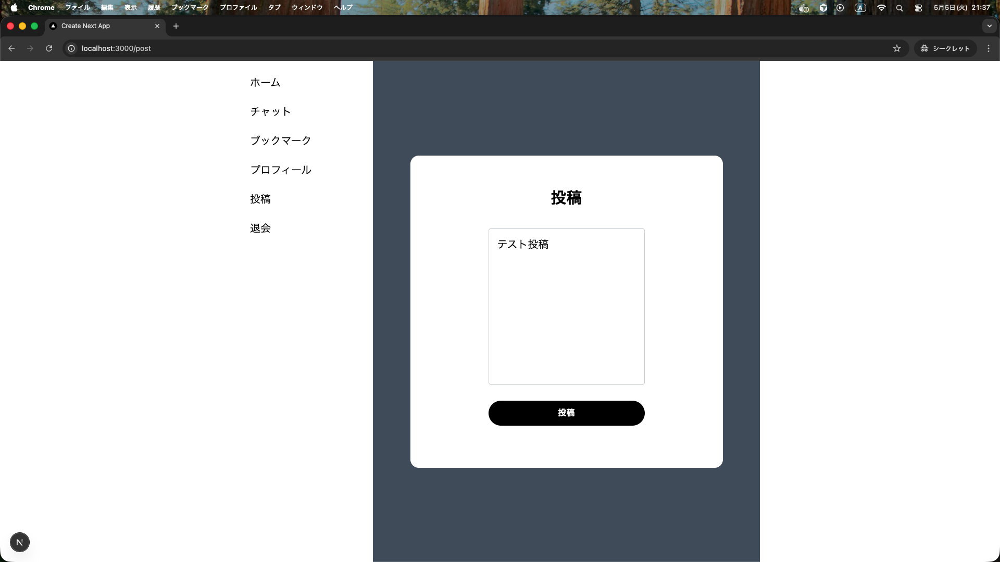

#### ツイート一覧

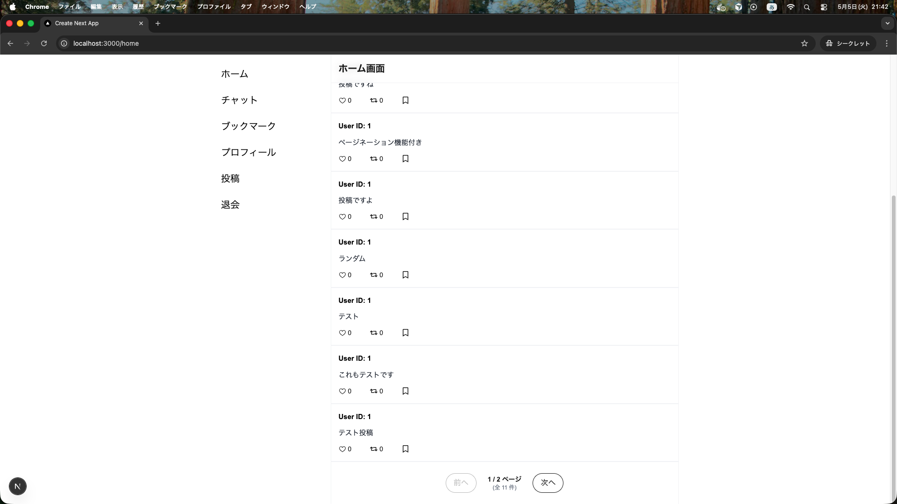

#### ツイート詳細

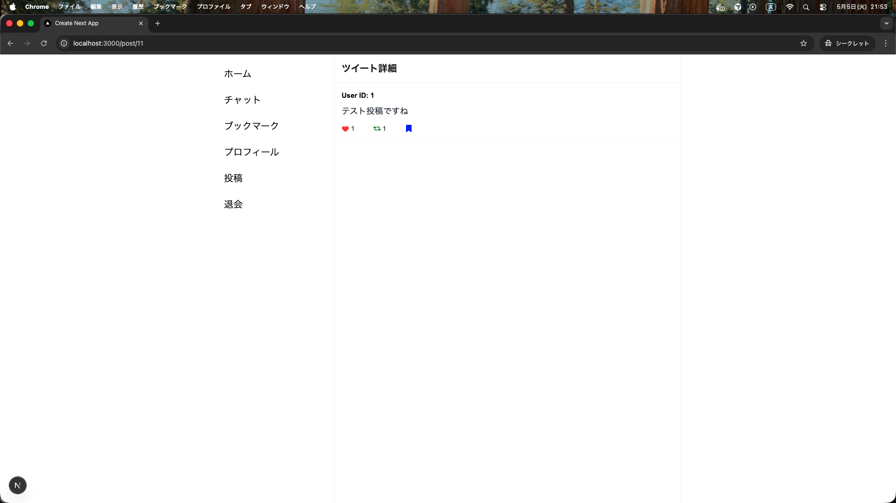

#### ユーザー詳細

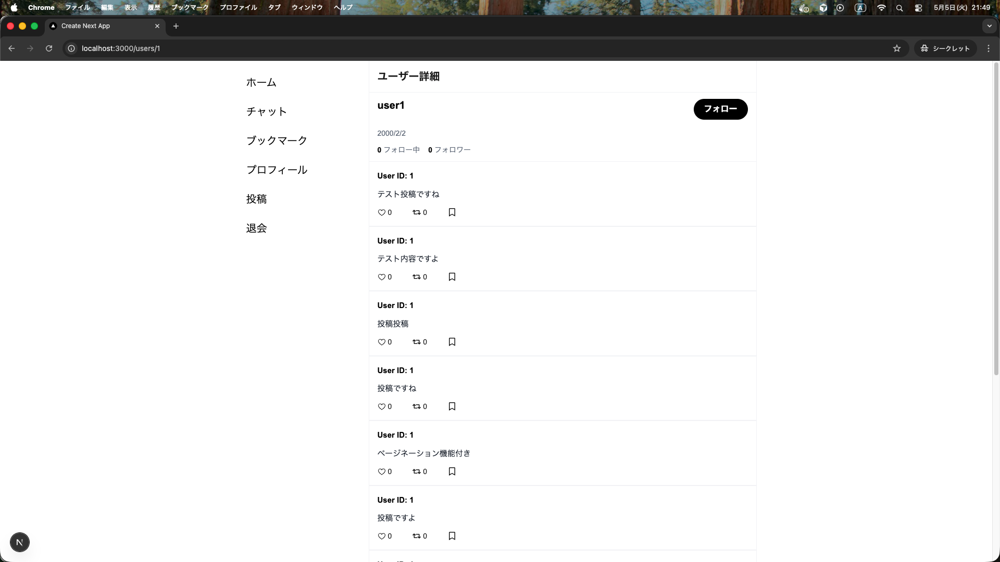

#### いいね・リツイート・ブックマーク(動画)

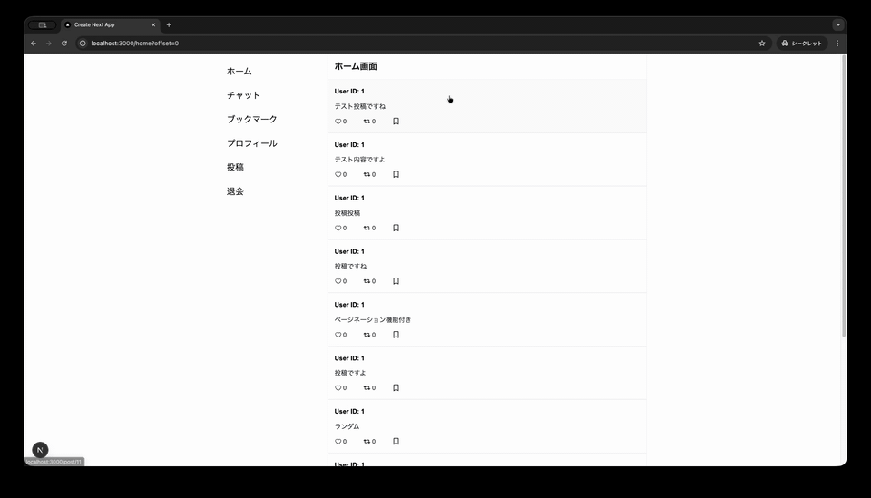

#### ブックマークしたツイート一覧

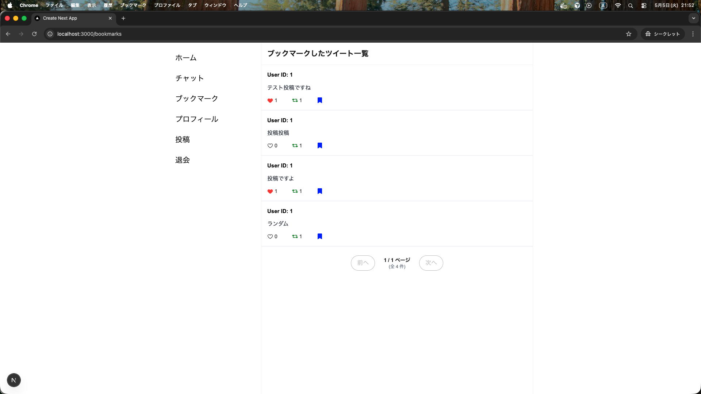

#### フォロー・フォロー解除(動画)

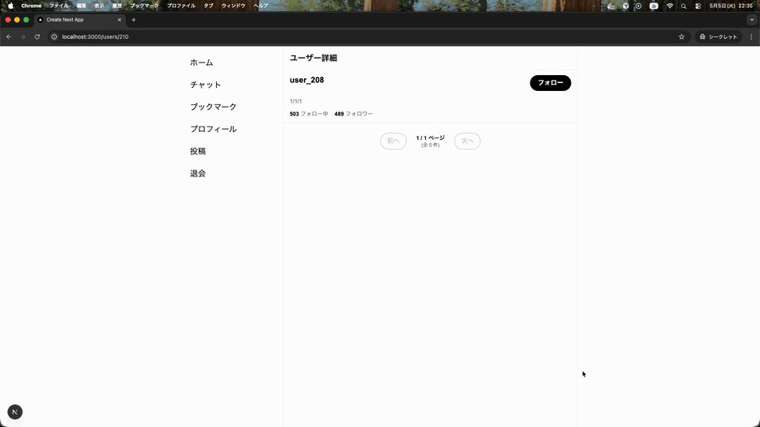

#### フォロー一覧

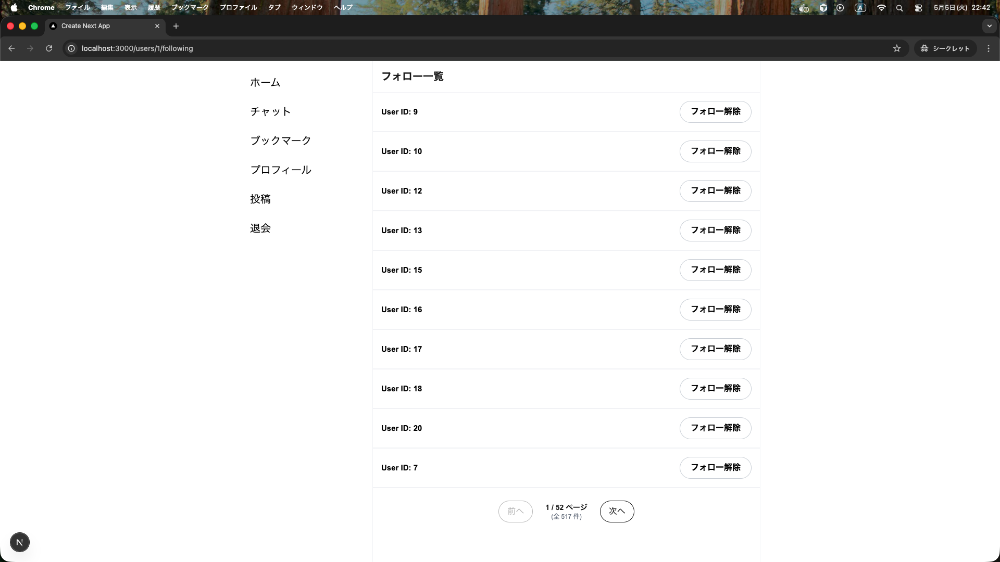

#### フォロワー一覧

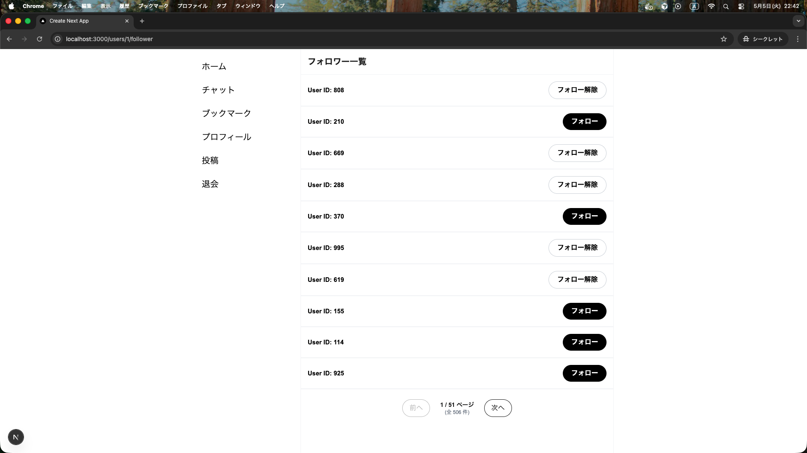

#### グループ作成

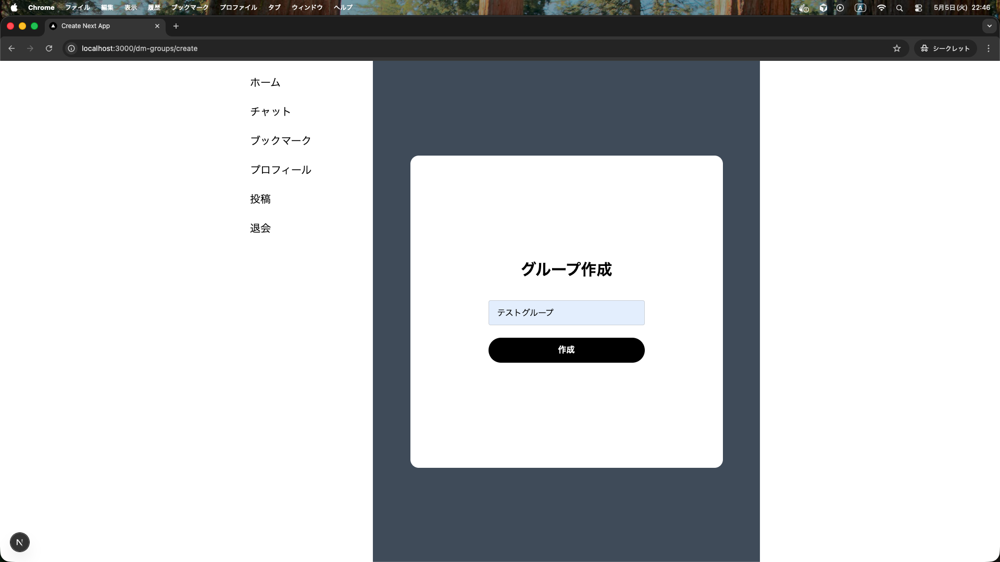

#### グループにユーザーを追加

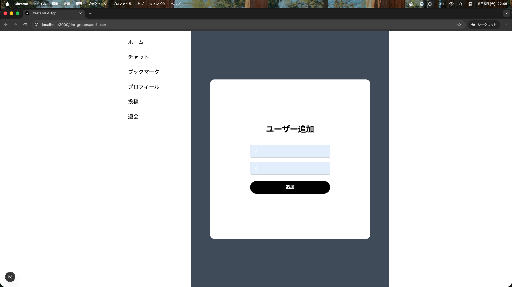

#### グループ一覧

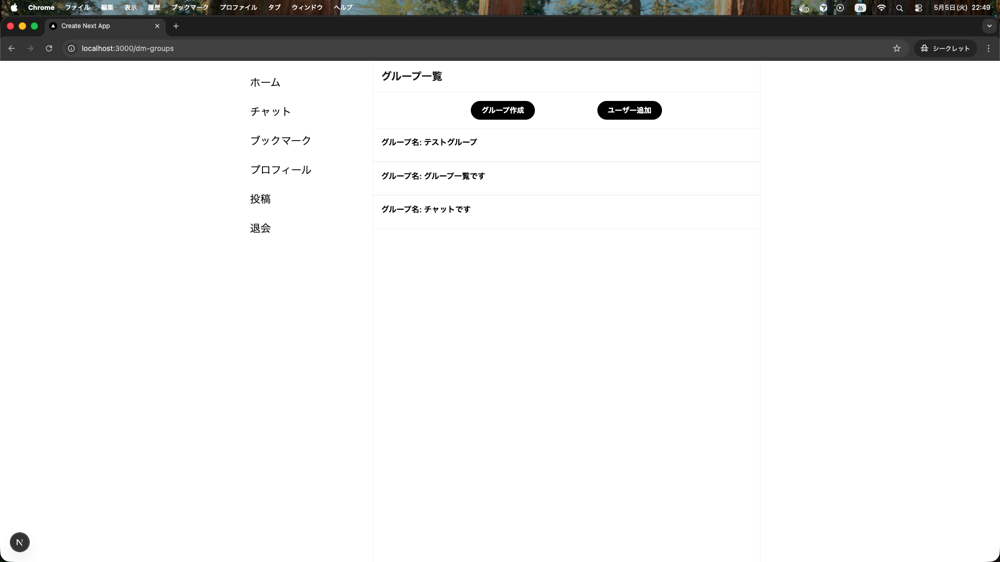

#### メッセージ一覧

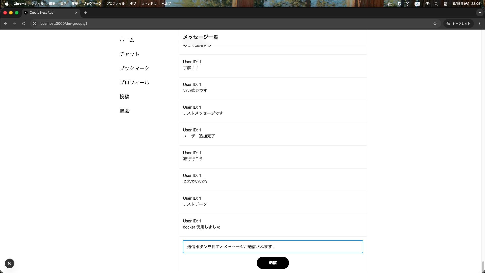

#### 退会(動画)

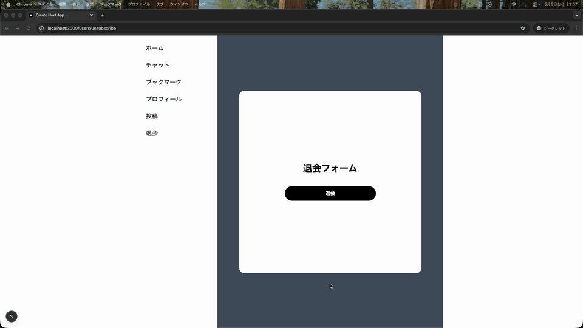

